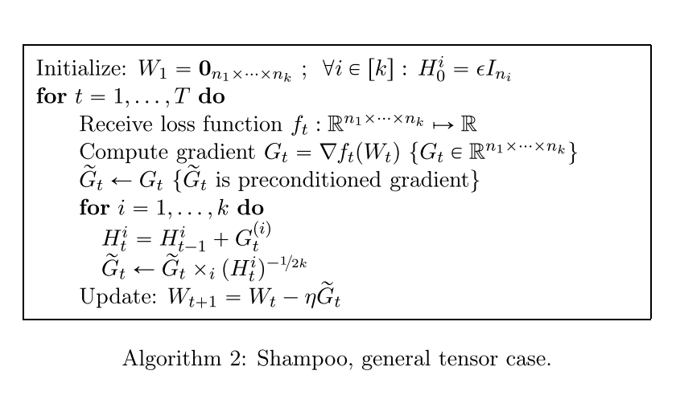

# shampoo.pytorch

An implementation of shampoo, proposed in **Shampoo : Preconditioned Stochastic Tensor Optimization** by Vineet Gupta, Tomer Koren and Yoram Singer.




```python
#  Suppose the size of the tensor grad (i, j, k),
#  dim_id = 1 and dim = j
grad = grad.transpose_(0, dim_id).contiguous()  # (j, i, k)
transposed_size = grad.size()
grad = grad.view(dim, -1)  # (j, i x k)
grad_t = grad.t()  # (i x k, j)
precond.add_(grad @ grad_t)  # (j, j)
inv_precond.copy_(_matrix_power(state[precond, -1 / order))  # (j, j)
grad = grad = inv_precond @ grad  # (j, i x k)
grad = grad.view(transposed_size)   # (j, i, k)
```